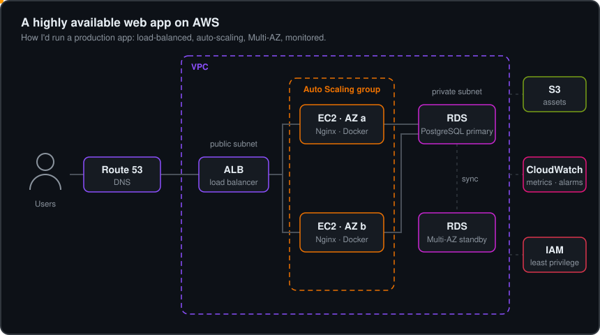

<h1 align="center">Hi, I'm Furi Sherpa Lama</h1>

<p align="center">
  <b>Aspiring DevOps &amp; Cloud Engineer</b> · AWS Certified Solutions Architect – Associate<br />
  Based in Kathmandu, Nepal
</p>

<p align="center">
  <a href="https://furi.info.np"></a>
  <a href="https://www.linkedin.com/in/lamafuri"></a>
  <a href="mailto:contact@furi.info.np"></a>
</p>

<p align="center">
  
</p>

---

## About me

I build and deploy full-stack JavaScript applications, from the database to the cloud server they run on.

```hcl
resource "cloud_engineer" "furi" {
  name          = "Furi Sherpa Lama"
  role          = "Aspiring DevOps & Cloud Engineer"
  location      = "Kathmandu, Nepal"
  certification = "AWS Certified Solutions Architect – Associate (SAA-C03, June 2026)"
  education     = "BSc (Hons) Computer Science with AI · Birmingham City University (Sunway College Kathmandu)"

  focus    = ["cloud", "devops", "backend"]
  learning = ["terraform", "kubernetes"]
  open_to  = ["full-time", "internships", "part-time / remote", "freelance"]

  highlights = [
    "Won 1st place in the DeerHack 2026 AI/ML track",
    "Built FlatShare, a MERN app used by 10 people in 2 shared flats for over 4 months",
  ]
}
```

---

## On AWS

<p align="center">
  <a href="https://www.credly.com/badges/99e06fd6-0ede-4ce8-8439-2aef47891cad/public_url"></a>
</p>

<p align="center">
  <b>AWS Certified Solutions Architect – Associate</b> · <a href="https://www.credly.com/badges/99e06fd6-0ede-4ce8-8439-2aef47891cad/public_url">verify on Credly</a>
</p>

<p align="center">
  
</p>

**How my apps ship**: every push to `main` is built and tested by GitHub Actions, packaged with Docker, and deployed to EC2 behind Nginx with SSL/TLS.

<p align="center">
  
</p>

---

## Tech stack

**Cloud & DevOps**

<p>
  
</p>

AWS: EC2 · S3 · VPC · IAM · RDS · Elastic Load Balancing · Auto Scaling · CloudWatch · Route 53<br />
Also: Docker Compose · CI/CD · Nginx reverse proxy with SSL/TLS · cron jobs

**Backend**

<p>
  
</p>

- **APIs:** REST API design with Node.js and Express · WebSockets
- **Auth:** JWT authentication with email OTP sign-up, and QR-code access for pharmacists (MedSync)
- **Background work:** 16 background jobs and cron scheduling (Kopila, FlatShare, MedSync)
- **Pipelines:** a 12-stage message-processing pipeline for Telegram messages and photos (Kopila)
- **Integrations:** a Python model service over REST, the Telegram Bot API, Google Gemini, and Cloudinary uploads
- **Data:** a 29-table PostgreSQL schema, and MongoDB with Mongoose
- **Testing:** 9 unit test suites that run without a database, network or API keys

**Databases**

<p>
  
</p>

**Frontend**

<p>
  
</p>

**Platforms & tools**

<p>
  
  
</p>

**Currently learning**

<p>
  
</p>

---

## Featured projects

| Project | What it is | Built with |
| --- | --- | --- |
| **[Kopila](https://github.com/lamafuri/Kopila)** · [live](https://kopila.vercel.app) | An AI co-pilot for new parents that joins a family's Telegram group and builds the child's health record from ordinary messages. 29 database tables, 16 background jobs, a 12-stage message pipeline. *Technical Lead, Hackaverse 2026.* | Node.js, Express, PostgreSQL, React, Telegram Bot API, Google Gemini, Vercel, Render |
| **Drug-Drug Interaction Risk Analyzer** | Checks every drug pair in a prescription against 1,317 known side effects with a graph neural network. *1st place, DeerHack 2026 AI/ML track. Backend and Systems Lead.* | React, Node.js, Express, PostgreSQL, Python model service, REST APIs |
| **[FlatShare](https://github.com/lamafuri/Flat-Share)** · [live](https://flat-share-v1.vercel.app) | Expense sharing for shared flats: email OTP sign-up, group invites, Nepali (Bikram Sambat) dates and per-person bills. 10 active users for 4+ months. | React, Node.js, Express, MongoDB Atlas, JWT, Tailwind CSS |
| **AWS Cloud Deployment Lab** | A full-stack app on EC2, served over HTTPS with Nginx as reverse proxy, containerized with Docker and built by GitHub Actions. | AWS EC2, Nginx, SSL/TLS, Docker, GitHub Actions, Ubuntu |
| **[MedSync](https://github.com/lamafuri/MedSync)** · [live](https://med-sync-yukti.vercel.app) | QR-based medicine tracking: patient and pharmacist apps on one database, with a daily cron job for stock. | MongoDB, Express, React, Node.js, JWT, Cloudinary |
| **[Portfolio](https://furi.info.np)** | This portfolio: a scroll-driven climb from base camp to the summit, tailored to why you're visiting. | React, TypeScript, Vite, Tailwind CSS, GSAP, Framer Motion |

---

## Achievements

- 🥇 **1st Place, AI/ML Track** · DeerHack 2026 (June 2026)
- 🏅 **Shortlisted, LumbiniX 2026 National Hackathon** · one of 10 teams nationwide (Aug 2026)
- 🥈 **Runner-Up, CodeCraft C Programming Challenge** · National School of Sciences, 2024–25 (~150 participants)
- ☁️ **AWS Certified Solutions Architect – Associate** · Amazon Web Services (June 2026)

---

<p align="center">
  <a href="https://furi.info.np">furi.info.np</a>
</p>
